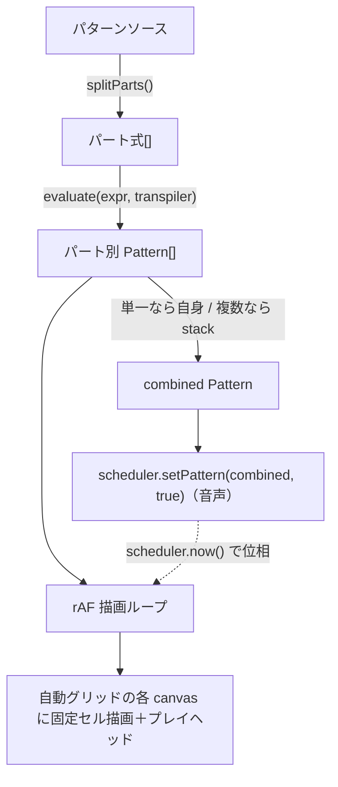

# パンチカード表示の刷新（固定セル・パート別グリッド・切替リセット）設計

**Goal:** 再生中のパターンを「パートごとに分割した自動グリッド」で表示し、各パートを「1サイクル固定グリッド＋プレイヘッド」で描く。ノーツ（セル）のサイズは音数に依存せず一定。別プロジェクト再生時は前の表示をリセットする。

**対象:** `site/`（ギャラリーサイト）。再生・音声は現状の `repl()` 構成を維持。

---

## 用語

- **パート**: ソース中の `$:`（JS のラベル付き文、label `$`）1 つ＝1 パート。`$:` が無いファイルは式全体を 1 パートとみなす。
- **セル**: 1 つのノーツ（ハップ）を表す矩形。固定サイズ。

## アーキテクチャ

## コンポーネント

### 1. パート分割 `splitParts(code)` → `string[]`（新規 `src/parts.js`）
- `$:` を境界に分割する。各パートはその `$:` の直後から次の `$:`（または EOF）までのコード。先頭の `$:` を除去して式文字列を返す。
- `$:` が無ければ `[code]`（1 要素）。
- 末尾セミコロン・空白はトリム。空パートは除外。
- 単体テスト（node:test）を `src/parts.test.mjs` に作る。

### 2. パート評価（`src/usePlayer.js`）
- `import { evaluate as evaluateCode } from '@strudel/core'`、`import { transpiler } from '@strudel/transpiler'`。
- 各パート式を `const { pattern } = await evaluateCode(expr, transpiler)` で Pattern 化（スケジュールしない）。
- 音声用 combined = パートが 1 つならそれ自身、複数なら `stack(...patterns)`。`stack` は `@strudel/core` から import。
- combined を再生: `await session.scheduler.setPattern(combined, true)`。確認済み実装は `setPattern(e, n=false){ this.pattern=e; n && !this.started && await this.start(); }`。再生中の差し替えは `this.pattern` 更新のみで音が途切れない。

### 3. 固定セル描画 `drawGrid(ctx, haps, phase, opts)`（新規 `src/punchcard.js`）
- 入力: 2D ctx、1 サイクル分のハップ配列、現在の位相 `phase`(0..1)、オプション（cellH, colors）。
- 行（row）: ハップ値から行キーを決める。`value.note`/`value.n` があればそれ、無ければ `value.s`（ドラム）。出現順で行インデックスを付与。
- レイアウト: `W = ctx.canvas.width`、`cellH` 固定。`canvas.height = rows * cellH`（描画前に呼び出し側で設定）。各ハップ: `x = begin01 * W`, `w = duration01 * W`, `y = rowIndex * cellH`。
- アクティブ判定: `phase` がそのハップの `[begin01, end01)` 内ならハイライト（明るい緑）、それ以外は淡い緑。CRT テーマ（`--phosphor`系）に合わせる。
- プレイヘッド: `x = phase * W` に縦線。
- 行ラベル（任意）: 左端に行キーを小さく描く。

### 4. 描画ループ（`src/usePlayer.js`）
- `requestAnimationFrame` ループを 1 本持つ。各フレーム:
  - `phase = scheduler.now() % 1`（`now()` は拍/サイクル時刻。未開始なら 0）。
  - 各パートについて `cycle = floor(now)` として `pattern.queryArc(cycle, cycle+1)` で 1 サイクル分のハップを取得し、`begin01/end01/duration01` をサイクル内 0..1 に正規化。
  - 対応する canvas に `drawGrid` で描画。
- ループは再生開始で start、停止で cancel。

### 5. 自動グリッドのレイアウト（`src/App.jsx` + `src/crt.css`）
- 画面上部スクリーン内に、パート数 N に応じて `cols = ceil(sqrt(N))` 列の CSS グリッドを敷き、各セルに `<canvas>` を 1 枚ずつ置く。
- canvas 群は `usePlayer` が管理する ref 配列で参照（再生時に N を確定）。N は最大上限（例 12）を設け、超過分は描画省略＋`log` 的に注記。
- 各 canvas は幅 100%、高さは行数×cellH（描画ループ内で設定）。セルがグリッド枠を超える場合は枠内スクロールまたはクリップ（固定セル優先）。

### 6. 切替リセット
- `play(id, code)` 冒頭で、既存の描画ループを停止し、全 canvas を clearRect、パート配列・パターンを破棄して再構築する。
- `stop()` でもループ停止＋全 canvas クリア。

## データフロー / 同期
- 音声と描画は同じ `scheduler.now()` を時刻源にするため位相が一致する。

## エラーハンドリング
- パート評価が失敗したら、そのパートは描画スキップしエラーバナーに `PART n: ...` を出す。少なくとも 1 パートが評価できれば音声・描画を続行。
- 全滅時は従来どおり `EVAL:` バナー。

## テスト
- `src/parts.test.mjs`: `splitParts` の分割・`$:` 無し・複数・末尾セミコロン・空行除外を検証（node:test）。
- 描画は手動確認（ブラウザ）。

## 影響ファイル
- 新規: `src/parts.js`, `src/parts.test.mjs`, `src/punchcard.js`
- 変更: `src/usePlayer.js`（パート評価・描画ループ・リセット）, `src/App.jsx`（canvas グリッド）, `src/crt.css`（グリッド配置）
- 既存の単一 `#test-canvas` + `Drawer` 経路は撤去。

## 非目標（YAGNI）
- パートの個別 mute/solo、ピアノロール表示、サンプル波形表示はやらない。
