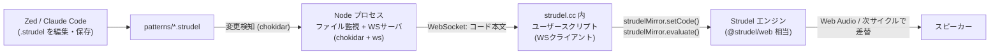

# 設計書: Strudel エディタ同期(ディレクトリ監視 + WebSocket + ユーザースクリプト)

- 日付: 2026-06-29
- ステータス: ドラフト(ユーザーレビュー待ち)

## 1. 目的

エディタに依存せず、ローカルのファイルを保存するだけで、ブラウザで動く Strudel(strudel.cc)のパターンが**音を途切れさせずに**差し替わる(ホットスワップ)ライブコーディング環境を作る。

- 主目的: 自分のエディタ(現在は **Zed**)で `.strudel` を編集 → 保存 → strudel.cc に即反映。
- 副次的に満たすもの: Claude Code が同じファイルを編集しても同様に同期される(エディタ非依存のため自動的に成立)。

## 2. 背景と意思決定の経緯

ブレインストーミングを通じて以下を確定した。

- **当初の動機**: Web 版で「ループ中に稀に音が消える」現象。原因はサンプル遅延読み込み(ローカル化で解決)か、CPU/AudioWorklet 負荷(ローカル化では解決しない)の2系統。今回は音飛び対策よりも「エディタ同期」を優先することにした。
- **完全オフラインは必須から除外**: 大半のユーザーはオンライン利用で、オフラインは少数派。今回の主目的ではない。
- **Zed の制約**: Zed は「保存時に任意コマンド実行」をネイティブ対応しておらず(zed-industries/zed#18523)、拡張機能で strudel.nvim のような深い統合を作るのは非現実的。→ **エディタ外のファイル監視ツール**が唯一きれいな解。
- **strudel.nvim(gruvw/strudel.nvim)は参考にしたが過剰**: Puppeteer + stdio で双方向カーソル同期まで作り込んだ実装。我々が必要なのは「保存したコードを送って評価させる」一方向のみ。Puppeteer もブラウザ自動操作も不要。
- **決定打**: strudel.cc の CodeMirror(`StrudelMirror` インスタンス)はブラウザのコンソールから到達可能(確認済み)。これにより、外部からブラウザを自動操作する代わりに、**strudel.cc ページ内に小さな WebSocket クライアントを1個入れ、受信したコードを `setCode → evaluate` する**だけで実現できる。
- **注入方法はユーザースクリプト**(Tampermonkey/Violentmonkey)を採用。一度入れれば strudel.cc を開くたび常時有効で、公式 UI・ビジュアルをそのまま使える。

## 3. アーキテクチャ

確立された部品のみで構成する。

- ファイル監視: [chokidar](https://github.com/paulmillr/chokidar)
- メッセージング: [ws](https://github.com/websockets/ws)(WebSocket サーバ)
- 注入: ユーザースクリプトマネージャ(Tampermonkey / Violentmonkey)
- 評価対象: strudel.cc 既存の `StrudelMirror` インスタンス

## 4. コンポーネント

### 4.1 Node 監視サーバ(`watch-server.mjs`)

- 役割: `patterns/` 配下(または指定ファイル)の `.strudel` を監視し、変更時にファイル内容を WebSocket で接続中クライアントへ配信する。
- 依存: `chokidar`, `ws`。
- 仕様:
  - WebSocket サーバを `ws://localhost:<PORT>`(既定ポートは実装時に確定。例 3001)で起動。
  - chokidar で監視。エディタの部分書き込み対策として `awaitWriteFinish` を有効化。
  - 変更検知 → ファイルを UTF-8 で読む → `{ type: "code", path, content }` を全クライアントへ送信。
  - クライアント新規接続時は、現在の対象ファイル内容を1回送って初期同期する。
  - 短時間の連続保存に対するデバウンス(例 50–100ms)。
- 入力: ファイルシステム上の `.strudel` 変更。
- 出力: WebSocket メッセージ。
- 依存先: chokidar, ws のみ。UI なし。

### 4.2 ユーザースクリプト(`strudel-sync.user.js`)

- 役割: strudel.cc ページ内で WS クライアントとして動作し、受信コードを Strudel に適用する。
- メタ: `@match https://strudel.cc/*`(必要に応じて `https://strudel.cc/` ルートのみ)。
- 仕様:
  - ページ読込後、`ws://localhost:<PORT>` へ接続。切断時は自動再接続(指数バックオフ等)。
  - メッセージ受信 → `const m = <StrudelMirrorインスタンス>; m.setCode(content); m.evaluate();` を実行(次サイクルからホットスワップ、音は途切れない)。
  - `evaluate()` が構文エラーで throw した場合は catch してログ表示。**直前の有効パターンは鳴り続ける**(Strudel の挙動)。
  - 接続状態を示す小さなオンページ表示(connected / disconnected)を出す。
- 依存先: strudel.cc が公開する `StrudelMirror` インスタンス。
  - 注: 正確なグローバル参照名(例 `window.strudelMirror` など)は**実装時にコンソールで確定**する。メソッドは `setCode(code)` と `evaluate()` を使用(必要に応じて `toggle()`/`stop()`)。

### 4.3 パターン置き場(`patterns/`)

- `.strudel` ファイルを置くディレクトリ。Zed / Claude Code で編集する実体。

### 4.4 `package.json`

- `dependencies`: `chokidar`, `ws`。
- `scripts`: `start`(= `node watch-server.mjs`)等。

## 5. データフロー

1. Zed(または Claude Code)で `patterns/foo.strudel` を保存。
2. chokidar が変更を検知(書き込み完了を待機)。
3. Node がファイルを読み、WebSocket で接続中の strudel.cc クライアントへ本文を配信。
4. ユーザースクリプトが受信し、`setCode(content)` で内容反映、`evaluate()` で評価。
5. Strudel が次サイクルでパターンを差し替え(AudioContext は維持、音は途切れない)。

## 6. 技術的前提・リスク

- **mixed-content(https → ws://localhost)**: `https://strudel.cc` から `ws://localhost` への接続は、ブラウザがループバック(localhost / 127.0.0.1)を "potentially trustworthy" として扱うため、Chromium 系では通る見込み。Firefox もループバック例外で概ね可。**最初に実機で要確認**。通らない場合のフォールバック: ローカル証明書で `wss://`、または将来案の「ローカル `@strudel/web` ページ(http://localhost 配信なので mixed-content が発生しない)」へ切替。
- **自動再生ポリシー**: 初回はユーザー操作が必要。strudel.cc ページ上で一度再生(クリック/Play)して AudioContext を起動しておく。以降は `evaluate()` でギャップなく差し替わる。
- **`StrudelMirror` グローバル参照**: コンソールから到達可能であることは確認済みだが、正確な参照名は実装時に確定する(strudel.cc 更新で変わり得る点はリスクとして認識)。
- **一方向同期**: コードはエディタ → strudel.cc の一方向のみ。strudel.nvim のような双方向カーソル同期は行わない(意図的な簡素化)。
- **音飛び(当初の動機)**: 本構成はオンラインの strudel.cc を使うため、サンプル遅延読み込み由来の音飛びは残り得る。完全対策は将来案(ローカル `@strudel/web` + `@strudel/sampler`)で対応。

## 7. エラー処理

- 構文エラー: `evaluate()` の例外を catch、直前パターンは鳴り続ける。エラーはオンページ表示/コンソールに出す。
- WS 切断: ユーザースクリプト側で自動再接続。Node サーバ再起動にも追従。
- 部分書き込み: chokidar `awaitWriteFinish` で回避。

## 8. 検証 / 完了条件

1. `npm install` 後、`npm start` で Node 監視サーバが起動する。
2. ユーザースクリプトを入れた状態で strudel.cc を開くと「connected」表示が出る。
3. 一度 Play して発音させた後、`patterns/foo.strudel` を編集・保存すると、**音が途切れずに**パターンが変わる。
4. 構文エラーを保存しても、直前パターンが鳴り続け、エラーが表示される。
5. WS サーバを再起動しても、ユーザースクリプトが自動再接続する。

## 9. スコープ外(将来フェーズ)

- ローカル `@strudel/web` ページ化(注入不要・mixed-content 回避・オフライン/ローカルサンプル容易)による音飛び完全対策。
- `@strudel/sampler` によるローカルサンプル配信。
- MCP(`@williamzujkowski/live-coding-music-mcp`)による Claude Code からの直接駆動。
- 双方向 / カーソル同期、VS Code 拡張対応。

## 10. 決定事項まとめ

| 論点 | 決定 |
|---|---|
| エディタ統合方式 | エディタ非依存(外部ファイル監視) |
| 同期トリガ | ディレクトリ監視(chokidar) |
| 伝送 | WebSocket(ws) |
| 評価対象 | strudel.cc(公式 UI/ビジュアルをそのまま利用) |
| 注入方法 | ユーザースクリプト(Tampermonkey/Violentmonkey) |
| 同期方向 | 一方向(エディタ → strudel.cc) |
| 完全オフライン | 今回は対象外(将来案) |
