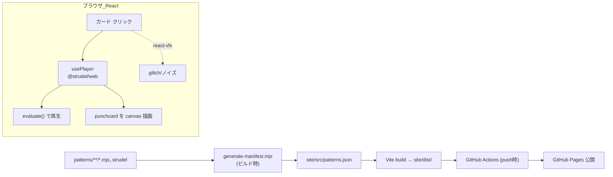

# 設計書: Strudel パターン・ギャラリーサイト

- 日付: 2026-06-29
- ステータス: ドラフト(ユーザーレビュー待ち)

## 1. 目的

`patterns/` に作った Strudel パターンを Web で**自分の学びの共有**として公開する。
プロジェクトをグリッド(テーブル状)に並べ、クリックすると**音が再生され、パンチカード(`punchcard`)が描画**される。
パターンを作って **push すると自動で全件公開**される。

## 2. 確定事項(ブレインストーミング結果)

- 掲載ソース: `patterns/` 配下の **全 `.mjs` / `.strudel` を自動掲載**(`_` 始まりのテンプレ等は除外)。
- 公開: **GitHub Pages + GitHub Actions**(push → 自動ビルド → 公開)。
- 構成: **React + Vite + ビルド時生成スクリプト**。
- 配置: **このリポジトリ内 `site/`**(`patterns/` を読むので同居が自然)。
- 再生/可視化: **`@strudel/web`** で再生、**`@strudel/draw` の `punchcard`/`pianoroll`** で描画。
- ビジュアル: **CRT モニタ風**。緑のリン光カラー + 走査線(scanlines) + ベゼル枠(固定) + フリッカー/ビネット + グリッチ/RGBずれ/ノイズ。フォントは **DotGothic16**(Google Fonts)。
- VFX: **`react-vfx`(`@vfx-js/react`)** で glitch/RGBずれ/ノイズを要素へ宣言的に適用。走査線・ベゼル・色味・フリッカーは CSS。
- UI 実装: **frontend-design スキル**を実装フェーズで使用する。
- identity: コミット/プッシュは個人アカウント **`syokenn334` / `yannyaya@icloud.com`**(`CLAUDE.md` 参照)。
- ライセンス: `@strudel/web`/`@strudel/draw` は **AGPL-3.0**。公開リポジトリ(ソース公開)で義務を満たす。リポジトリに `LICENSE`(AGPL-3.0)を置く。

## 3. アーキテクチャ

## 4. コンポーネント

各ファイルは単一責務とする。

### 4.1 `site/scripts/generate-manifest.mjs`
- 役割: `../patterns/` を走査し、掲載対象を `site/src/patterns.json` に書き出す。
- 仕様:
  - 対象: `**/*.mjs` と `**/*.strudel`。
  - 除外: ベース名が `_` 始まり(例 `_template.mjs`)。
  - 各エントリ: `{ id, title, file, code }`。
    - `id`: パスから生成した安定スラッグ(例 `practice__2026-06-29-day1`)。
    - `title`: コード内の `// @title 〜` があればその値、なければ拡張子なしファイル名。
    - `code`: ファイル全文(UTF-8。コメントは Strudel が無視するのでそのまま)。
- 入力: ファイルシステム。出力: `patterns.json`。依存: Node 標準のみ。

### 4.2 `site/src/usePlayer.js`(React フック)
- 役割: Strudel エンジンを React から扱うフック。
- 公開 API: `usePlayer()` → `{ playingId, play(id, code, canvas), stop() }`。
- 内部: `@strudel/web` の `initStrudel()` はアプリ起動時に1回だけ(モジュールスコープ or 初回 effect)。`play` は `evaluate(code)`、`stop` は停止。**同時再生は1つ**(別 id を play すると前を停止)。
- 可視化: `@strudel/draw` でパンチカードを指定 canvas に描画(詳細は §7 のスパイクで確定)。
- 依存: `@strudel/web`, `@strudel/draw`, React。

### 4.3 React アプリ(`site/src/main.jsx` / `App.jsx` / `Card.jsx` / `index.html`)
- `main.jsx`: `ReactDOM.createRoot` でマウント。
- `App.jsx`: `patterns.json` を読み、`usePlayer()` の `playingId` を状態として保持し、**グリッド**に `<Card>` を並べる。
- `Card.jsx`: 1パターン分。タイトル + パンチカード用 `<canvas>` + 再生/停止ボタン。**`react-vfx`** でカード/文字に glitch/ノイズを宣言的に付与。クリックで `play(id, code, canvas)`、再生中カードは再クリックで `stop()`。
- 初回クリックがユーザー操作なので AudioContext が起動(自動再生ポリシー対策)。
- `index.html`: ルート要素 + DotGothic16 の Google Fonts 読み込み。

### 4.4 `site/package.json` / `site/vite.config.js`
- 役割: ギャラリーを**自己完結した npm プロジェクト**にする(同期ツールの依存と分離)。
- `dependencies`: `react`, `react-dom`, `@strudel/web`, `@strudel/draw`, `@vfx-js/react`。
- `devDependencies`: `vite`, `@vitejs/plugin-react`。
- scripts: `generate`(= node scripts/generate-manifest.mjs)、`build`(= generate && vite build)、`dev`、`preview`。
- `vite.config.js`: `@vitejs/plugin-react` を有効化。`base` は GitHub Pages のサブパスに合わせる(`configure-pages` 出力を使用)。

### 4.5 `.github/workflows/deploy.yml`
- 役割: push → ビルド → Pages デプロイ。
- 仕様: `on: push: branches: [main]`。`cd site && npm ci && npm run build` → `actions/upload-pages-artifact`(`site/dist`)→ `actions/deploy-pages`。`configure-pages` で base path を取得。

### 4.6 `LICENSE`
- リポジトリルートに **AGPL-3.0** 全文。

### 4.7 `site/src/crt.css`(CRT ビジュアル)
- 役割: CRT モニタ風の見た目を CSS で表現。
- 内容: 緑のリン光カラー(本文/枠)、`DotGothic16` 適用、走査線(`repeating-linear-gradient` のオーバーレイ)、フリッカー(微小な opacity アニメーション)、ビネット、**モニタのベゼル枠**(`position: fixed` の外枠で画面を囲う)。
- glitch / RGBずれ / ノイズは `react-vfx`(§4.3)で要素に付与し、CSS と併用する。

## 5. データフロー

1. `patterns/` にパターンを追加して main に push。
2. GitHub Actions が `site` で `npm run build` を実行 → `generate-manifest.mjs` が `patterns.json` を生成 → Vite が `dist/` を生成。
3. `dist/` を GitHub Pages にデプロイ。
4. 閲覧者がカードをクリック → `@strudel/web` が `evaluate(code)` で再生し、canvas にパンチカードを描画。

## 6. エラー処理

- 評価エラーのパターン: そのカードのみエラー表示にし、ギャラリー全体は壊さない(他カードは再生可能)。
- 掲載パターンが0件: 「まだパターンがありません」を表示。
- ビルド時 `patterns/` 不在: 空マニフェストを出力(ビルドは失敗させない)。

## 7. 実装上のリスク / 先に潰すスパイク

- **任意パターンのパンチカード描画**: `@strudel/web` は既定で自動描画しない。`@strudel/draw` で、評価済みパターンを**カードごとの canvas** に描く正確な API を、実装の最初のタスクで**スパイク検証**する。
  - 第一候補: 評価したパターンに対して `punchcard`/`pianoroll`(または `drawPianoroll`)を canvas 指定で呼ぶ。
  - 複数文・コメント混在のパターン(練習ログ等)でも描けるか確認。難しい場合は「単一式パターンは確実に描画、複数文は音のみ」と制約を明記する(サイレント劣化させない)。
- **Vite の `base`**: Pages のサブパス(`/<repo>/`)を正しく設定しないとアセット 404 になる。Actions の `configure-pages` 出力を使う。
- **AGPL**: バンドルに `@strudel/web`/`@strudel/draw`/`@vfx-js/react` を含むため、公開リポジトリ(ソース公開)前提を崩さない。
- **画面全体の樽型歪み(CRT 湾曲)**: `react-vfx` は要素単位のため画面全体の湾曲は守備範囲外。実装初手で、(a) 全画面シェーダで DOM をテクスチャ化して歪ませる / (b) CSS・SVG で擬似湾曲 / (c) 湾曲は省き走査線+グリッチ+ベゼルで CRT 感を出す、のどれを採るかスパイクで決める。難しければ (c) に落とす(サイレントに諦めない)。
- **DotGothic16**: Google Fonts から読み込む(オフライン要件はないので CDN でよい)。

## 8. テスト / 検証

- `generate-manifest.mjs`: `node:test` で単体テスト(一時 `patterns/` を与え、対象抽出・`_` 除外・title 規約を検証)。
- 再生/パンチカード/レイアウト: ブラウザでの手動検証(音・描画は自動テスト困難)。
- デプロイ: Actions 成功 + Pages URL でカードが表示・再生されることを確認。

## 9. スコープ外(将来)

- 検索/タグ/フィルタ、いいね・コメント、録音/書き出し、複数同時再生、モバイル最適化。

## 10. セットアップ前提(実装時)

- 個人アカウント `syokenn334` で GitHub リポジトリを作成し、`gh auth switch --user syokenn334` 後に push。
- リポジトリ設定で Pages を「GitHub Actions」ソースに設定。
