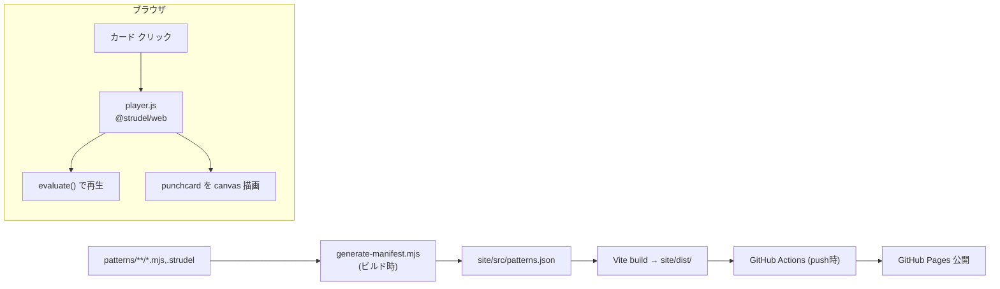

# 設計書: Strudel パターン・ギャラリーサイト

- 日付: 2026-06-29
- ステータス: ドラフト(ユーザーレビュー待ち)

## 1. 目的

`patterns/` に作った Strudel パターンを Web で**自分の学びの共有**として公開する。
プロジェクトをグリッド(テーブル状)に並べ、クリックすると**音が再生され、パンチカード(`punchcard`)が描画**される。
パターンを作って **push すると自動で全件公開**される。

## 2. 確定事項(ブレインストーミング結果)

- 掲載ソース: `patterns/` 配下の **全 `.mjs` / `.strudel` を自動掲載**(`_` 始まりのテンプレ等は除外)。
- 公開: **GitHub Pages + GitHub Actions**(push → 自動ビルド → 公開)。
- 構成: **Vite + バニラ JS + ビルド時生成スクリプト**(フレームワークなし)。
- 配置: **このリポジトリ内 `site/`**(`patterns/` を読むので同居が自然)。
- 再生/可視化: **`@strudel/web`** で再生、**`@strudel/draw` の `punchcard`/`pianoroll`** で描画。
- identity: コミット/プッシュは個人アカウント **`syokenn334` / `yannyaya@icloud.com`**(`CLAUDE.md` 参照)。
- ライセンス: `@strudel/web`/`@strudel/draw` は **AGPL-3.0**。公開リポジトリ(ソース公開)で義務を満たす。リポジトリに `LICENSE`(AGPL-3.0)を置く。

## 3. アーキテクチャ

## 4. コンポーネント

各ファイルは単一責務とする。

### 4.1 `site/scripts/generate-manifest.mjs`
- 役割: `../patterns/` を走査し、掲載対象を `site/src/patterns.json` に書き出す。
- 仕様:
  - 対象: `**/*.mjs` と `**/*.strudel`。
  - 除外: ベース名が `_` 始まり(例 `_template.mjs`)。
  - 各エントリ: `{ id, title, file, code }`。
    - `id`: パスから生成した安定スラッグ(例 `practice__2026-06-29-day1`)。
    - `title`: コード内の `// @title 〜` があればその値、なければ拡張子なしファイル名。
    - `code`: ファイル全文(UTF-8。コメントは Strudel が無視するのでそのまま)。
- 入力: ファイルシステム。出力: `patterns.json`。依存: Node 標準のみ。

### 4.2 `site/src/player.js`
- 役割: Strudel エンジンのラッパ。
- 公開 API: `init()` / `play(code)` / `stop()` / `drawPunchcard(code, canvas)`。
- 内部: `@strudel/web` の `initStrudel()` は1回だけ。`play` は `evaluate(code)`、`stop` は停止。
- 可視化: `@strudel/draw` でパンチカードを指定 canvas に描画(詳細は §7 のスパイクで確定)。
- 依存: `@strudel/web`, `@strudel/draw`。

### 4.3 `site/src/main.js` + `site/index.html`
- 役割: ギャラリー UI。
- 仕様:
  - `patterns.json` を読み、**グリッド**にカードを描画(各カード: タイトル + canvas + 再生ボタン)。
  - カードクリックで `player.play(code)` し、そのカードの canvas にパンチカード描画。
  - **同時再生は1つ**(別カードを押すと前を停止)。再クリックで停止。
  - 初回クリックがユーザー操作なので AudioContext が起動(自動再生ポリシー対策)。
- 依存: `player.js`, `patterns.json`。

### 4.4 `site/package.json` / `site/vite.config.js`
- 役割: ギャラリーを**自己完結した npm プロジェクト**にする(同期ツールの依存と分離)。
- `dependencies`: `@strudel/web`, `@strudel/draw`。`devDependencies`: `vite`。
- scripts: `generate`(= node scripts/generate-manifest.mjs)、`build`(= generate && vite build)、`dev`、`preview`。
- Vite の `base` は GitHub Pages のサブパスに合わせて設定(リポジトリ名 or ユーザーサイト)。

### 4.5 `.github/workflows/deploy.yml`
- 役割: push → ビルド → Pages デプロイ。
- 仕様: `on: push: branches: [main]`。`cd site && npm ci && npm run build` → `actions/upload-pages-artifact`(`site/dist`)→ `actions/deploy-pages`。`configure-pages` で base path を取得。

### 4.6 `LICENSE`
- リポジトリルートに **AGPL-3.0** 全文。

## 5. データフロー

1. `patterns/` にパターンを追加して main に push。
2. GitHub Actions が `site` で `npm run build` を実行 → `generate-manifest.mjs` が `patterns.json` を生成 → Vite が `dist/` を生成。
3. `dist/` を GitHub Pages にデプロイ。
4. 閲覧者がカードをクリック → `@strudel/web` が `evaluate(code)` で再生し、canvas にパンチカードを描画。

## 6. エラー処理

- 評価エラーのパターン: そのカードのみエラー表示にし、ギャラリー全体は壊さない(他カードは再生可能)。
- 掲載パターンが0件: 「まだパターンがありません」を表示。
- ビルド時 `patterns/` 不在: 空マニフェストを出力(ビルドは失敗させない)。

## 7. 実装上のリスク / 先に潰すスパイク

- **任意パターンのパンチカード描画**: `@strudel/web` は既定で自動描画しない。`@strudel/draw` で、評価済みパターンを**カードごとの canvas** に描く正確な API を、実装の最初のタスクで**スパイク検証**する。
  - 第一候補: 評価したパターンに対して `punchcard`/`pianoroll`(または `drawPianoroll`)を canvas 指定で呼ぶ。
  - 複数文・コメント混在のパターン(練習ログ等)でも描けるか確認。難しい場合は「単一式パターンは確実に描画、複数文は音のみ」と制約を明記する(サイレント劣化させない)。
- **Vite の `base`**: Pages のサブパス(`/<repo>/`)を正しく設定しないとアセット 404 になる。Actions の `configure-pages` 出力を使う。
- **AGPL**: バンドルに `@strudel/web`/`@strudel/draw` を含むため、公開リポジトリ(ソース公開)前提を崩さない。

## 8. テスト / 検証

- `generate-manifest.mjs`: `node:test` で単体テスト(一時 `patterns/` を与え、対象抽出・`_` 除外・title 規約を検証)。
- 再生/パンチカード/レイアウト: ブラウザでの手動検証(音・描画は自動テスト困難)。
- デプロイ: Actions 成功 + Pages URL でカードが表示・再生されることを確認。

## 9. スコープ外(将来)

- 検索/タグ/フィルタ、いいね・コメント、録音/書き出し、複数同時再生、モバイル最適化。

## 10. セットアップ前提(実装時)

- 個人アカウント `syokenn334` で GitHub リポジトリを作成し、`gh auth switch --user syokenn334` 後に push。
- リポジトリ設定で Pages を「GitHub Actions」ソースに設定。
