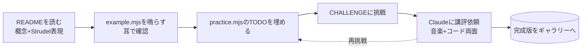

# Strudel 作曲学習フロー 設計書

- 日付: 2026-06-30
- ステータス: 設計承認済み(実装計画へ)
- 対象リポジトリ: `strudel-editor-sync`(本リポジトリ)

## 1. 目的とゴール

音楽理論・作曲ともに初学者(ただし JavaScript / コードは得意)である学習者が、
**ハウス/テクノを題材に、音楽理論と Strudel の使い方を同時に学びながら**、
最終的に **構成のある 1 曲** を自力で作れるようになるための、リポジトリ内完結の段階的学習フローを構築する。

学習者は Strudel 自体も初めて触る。したがって「音楽理論」と「Strudel の操作・考え方」の
**二本立て**で各レッスンを設計する。

### 成功基準

- 統合課題 D(構成のある 1 曲)を学習者が自力で完成できる。
- 各統合課題で使った音楽理論を、学習者が自分の言葉で説明できる。
- 各モジュールが「概念 → Strudel 表現 → 練習 → 講評」で独立完結する。

## 2. 確定した前提(ブレインストーミングでの決定)

| 項目 | 決定 |
|---|---|
| ゴール | 理論を理解しながら作る |
| 音楽理論レベル | ほぼ初学 |
| Strudel 経験 | 初めて(コード/JS は得意) |
| 成果物の形 | リポジトリ内レッスン集 + AI(Claude)講評 |
| ジャンル | ハウス/テクノ系 |
| カリキュラム構造 | 概念別モジュール + 統合課題(節目で合体) |
| 言語 | 日本語 |

## 3. アーキテクチャ / ディレクトリ構成

```
lessons/
  README.md          # ロードマップ / 進め方 / 練習の起動手順
  CHEATSHEET.md      # 「作曲概念 ↔ Strudel 関数」対応表 兼 Strudel 構文早見表(進行に合わせ加筆)
  GLOSSARY.md        # 初学者向け用語集(拍・小節・度数・転回・テンション 等)
  01-cycle-and-kick/
    README.md        # 理論解説(日本語)+ Strudel での表現。冒頭に「今回の Strudel」「今回の音楽理論」
    example.mjs      # 最小の動く見本(コメント密)
    practice.mjs     # TODO 穴埋め課題
    CHALLENGE.md     # 課題要件 + 完成チェックリスト(= 講評の rubric)
  02-.../            # 同形式
  integration-A-beat/   # 統合課題(節目)
    README.md  brief.mjs  rubric.md
```

- パターンは `.mjs` で統一(`types/strudel.d.ts` による補完が効くため。`.strudel` は補完対象外)。
- 各レッスンフォルダは「1 つの音楽概念 + 1 つの Strudel 操作」を担う独立ユニット。
  README を読めば何を学ぶか分かり、`example.mjs` / `practice.mjs` は単体で動く。

## 4. 練習エンジン(既存 editor-sync の再利用)

既存の同期サーバ(`lib/server.mjs` / `watch-server.mjs`)は、
**監視ディレクトリを再帰的に監視し、保存されたファイルの内容をそのまま strudel.cc に送る**
(最後に保存したファイルが有効化される)実装であることを確認済み。

したがって練習フローは次のとおり、追加実装なしで成立する:

1. `PATTERNS_DIR=lessons npm start` で `lessons/` 配下を監視。
2. strudel.cc にブックマークレット/ユーザースクリプトを注入し、一度 Play(既存手順)。
3. 学習者が任意のレッスンの `example.mjs` / `practice.mjs` を Zed で開いて保存 → 即試聴。
4. 再生/停止は既存の `npm run play/stop/toggle`(Zed タスク)で行う。

注意: 同期は常に「最後に保存した 1 ファイル」が有効。学習者は 1 ファイルずつ扱う前提。

## 5. モジュール一覧(初版)

各モジュールは「学ぶ Strudel 操作」と「学ぶ音楽理論」を 1 つずつ進める。
記載の Strudel 関数名・記法は代表例であり、**レッスン執筆時に公式ドキュメントで関数名・引数を確認**してから確定する(造語・推測 API を本文に残さない)。

### Phase 0 オリエンテーション

| # | モジュール | 学ぶ Strudel | 学ぶ音楽理論 |
|---|---|---|---|
| M0 | はじめの一歩 | サイクル/パターンの考え方・ミニ記法の読み方・`PATTERNS_DIR=lessons npm start`・評価で音を出す | 拍と小節(時間の捉え方) |

### Phase 1 リズム編(土台)

| # | モジュール | 学ぶ Strudel | 学ぶ音楽理論 |
|---|---|---|---|
| M1 | サイクルとキック | `s("bd*4")`・`*` 連符・`setcpm` | 4 つ打ち・テンポ・拍子 |
| M2 | ハットと細分化 | `[]` グループ・`~` 休符・`stack`/`,`・`<>` 交替 | サブディビジョン(8/16 分)・レイヤー |
| M3 | グルーヴ | `swingBy`・`euclid`・`gain`・`struct` | スウィング・シンコペーション・アクセント |
| 統合A | ビート完成 | 既習を合体 | 2 小節ドラム |

### Phase 2 音色・ベース編

| # | モジュール | 学ぶ Strudel | 学ぶ音楽理論 |
|---|---|---|---|
| M4 | サウンド基礎 | `note`/`n`・シンセ波形・`attack/decay/sustain/release` | 音色・ADSR と音の立ち上がり |
| M5 | フィルターと空間 | `lpf`/`cutoff`・レゾナンス・`room`・`delay`・`sine.range()` | 周波数・倍音・残響 |
| M6 | ベースライン | `scale("c:minor")`・`n` で度数・オクターブ | マイナースケール・ルート・キックとの住み分け |
| 統合B | グルーヴ完成 | 合体 | ドラム+ベース |

### Phase 3 和声編(理論の核)

| # | モジュール | 学ぶ Strudel | 学ぶ音楽理論 |
|---|---|---|---|
| M7 | スケールと音程 | `scale` 各種・モード名 | メジャー/マイナー・度数・モード(ドリアン等) |
| M8 | 和音の基礎 | `note("c eb g")`・`"<Am F C G>"` | 三和音・コード記号・進行と `<>` |
| M9 | テンション/ボイシング | `voicing()`・`rootNotes()`・転回 | 7th/9th・ボイシング・ベース連動 |
| 統合C | 1 コーラス完成 | 合体 | ドラム+ベース+コード+パッド |

### Phase 4 構成・仕上げ

| # | モジュール | 学ぶ Strudel | 学ぶ音楽理論 |
|---|---|---|---|
| M10 | アレンジ/テクスチャ | `mask`/`when`/`every`・signals/LFO | 密度・レジスター・テクスチャ |
| M11 | 曲の構成 | `arrange`・`cat`・`<>` 区間 | イントロ/ビルド/ブレイク/ドロップ |
| M12 | ミックス/作品化 | `gain`/`pan`/`room` バランス | ミックス基礎 |
| 統合D | 1 曲完成(最終) | 全合体 | 構成のある 1 曲 → ギャラリー公開 |

計: M0 + 12 モジュール + 4 統合課題。1 モジュールあたり 1〜2 時間想定(調整可)。

## 6. 1 レッスンの学習ループ



## 7. AI 講評(Claude)の役割

各 `CHALLENGE.md` に rubric を明記し、講評の観点を固定する:

1. 課題要件の充足。
2. 音楽理論的な妥当性(スケール/進行/リズムの整合)。
3. Strudel コードの簡潔さ・慣用(冗長さ、より良い書き方)。
4. 次の一歩の提案。

頼み方: Zed で対象 `.mjs` を開き「lesson NN を講評して」と依頼。Claude は当該 `CHALLENGE.md` の rubric を参照して講評する。
初期は対話のみで十分。将来的に `npm run review NN` のような薄い導線を追加してもよい(初期スコープ外)。

## 8. 教え方の方針

- 理論は **最初は手書き(音名)で理解 → 後で `scale()` / `voicing()` 等のヘルパーに置換** の順で進める。
  「魔法の関数」で済ませず、何が起きているかを先に体で掴ませる。
- 各 README 冒頭に「今回の Strudel」「今回の音楽理論」を明示し、二本立てを毎回意識させる。
- `CHEATSHEET.md` は対応表に加えて Strudel 構文の早見表を兼ねる(Strudel 初学のため操作の参照先が要る)。

## 9. スコープ外(YAGNI)

- ブラウザ学習サイト / インタラクティブ UI。
- 自動採点・自動テスト(講評は人=Claude が担当)。
- 音源書き出しの自動化、譜面表示。
- `npm run review` 等のツール化(初期は対話で代替)。

## 10. 既知の確認事項 / リスク

- レッスン本文に書く Strudel 関数名・引数は、執筆時に公式ドキュメント(strudel.cc)で必ず確認する。
  本設計書の関数名は代表例であり確定 API ではない。
- ギャラリーへの作品登録は既存スペック(`2026-06-29-strudel-gallery-site-design.md`)のフローに従う。
  統合課題の成果物をギャラリーへ載せる導線は、その仕様に合わせて確認する。
- 監視は「最後に保存した 1 ファイル」単位。複数ファイルの同時合成は editor-sync の対象外
  (合体は 1 つの `.mjs` 内で `stack` 等を用いて行う)。
